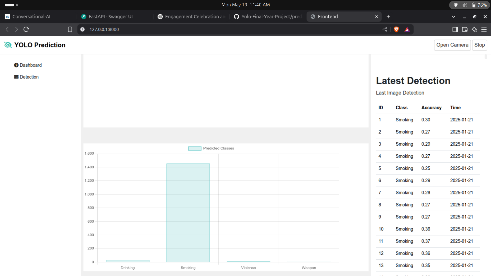
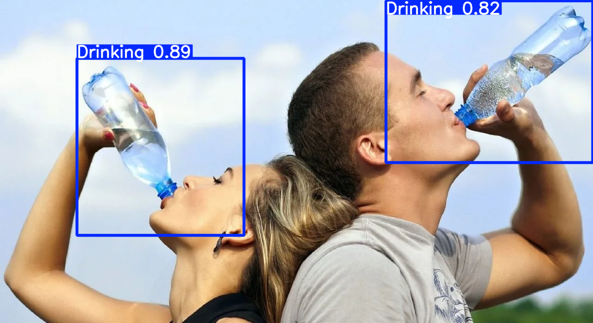

# YOLO-Based Object Detection with FastAPI - Final Year Project



This project is a YOLO (You Only Look Once) object detection system built using FastAPI. It provides real-time predictions and visualizations, leveraging the YOLO model for detecting specific activities or objects. This project is developed for a final-year academic project.

## Features

- **Object Detection:** Predict objects in uploaded images using a custom YOLO model (`best5.pt`).
- **Custom Trained Classes:** Detects the following classes:
  - Drinking
  - Eating
  - Violence
  - Sleeping
  - Smoking
  - Walking
  - Weapon
- **Real-Time Prediction API:** Upload images and get annotated predictions with bounding boxes and confidence scores.
- **Database Storage:** Stores prediction results (class name, accuracy, and timestamp) in a database.
- **Data Visualization:** View class-wise prediction counts in a bar chart.

## Technology Stack

- **Backend Framework:** FastAPI
- **Model:** YOLO (Ultralytics)
- **Database:** SQLAlchemy with SQLite
- **Frontend:** Jinja2 Templates, HTML, CSS, JavaScript (Bootstrap, Chart.js)

## How to Run the Project

### Prerequisites

1. Python 3.8+ installed.
2. Install dependencies using the `requirements.txt` file.

### Steps to Run

1. Clone the repository:
   ```bash
   git clone https://github.com/alihassanml/Yolo-Final-Year-Project.git
   cd Yolo-Final-Year-Project
   ```

2. Create and activate a virtual environment:
   ```bash
   python -m venv venv
   source venv/bin/activate    # On Linux/Mac
   venv\Scripts\activate       # On Windows
   ```

3. Install dependencies:
   ```bash
   pip install -r requirements.txt
   ```

4. Start the FastAPI server:
   ```bash
   uvicorn app:app --reload
   ```

5. Open your browser and navigate to:
   ```
   http://127.0.0.1:8000
   ```

6. Use the web interface to upload images and view predictions.

### API Endpoints

- `GET /`  
  Returns the homepage.

- `POST /predict`  
  Upload an image and receive predictions with annotated bounding boxes.

- `GET /predictions`  
  Retrieve a list of all predictions stored in the database.

- `GET /class-counts`  
  Get class-wise counts of predictions for visualization.

## Project Structure

```
Yolo-Final-Year-Project/
│
├── app.py                 # Main FastAPI application
├── model/
│   ├── best5.pt           # YOLO pre-trained model weights
│   └── __init__.py        # Package initialization
│
├── database.py            # Database configuration
├── model.py               # SQLAlchemy models
├── static/
│   ├── style.css          # CSS for styling
│   ├── script.js          # JavaScript functionality
│   └── uploads/           # Uploaded images folder
│
├── templates/
│   └── index.html         # Jinja2 template for the frontend
│
├── requirements.txt       # Python dependencies
├── README.md              # Project documentation
└── .gitignore             # Files to ignore in the repository
```

## Future Enhancements

- Add video-based detection for live streams.
- Integrate a user authentication system for secure access.
- Expand the model to detect additional classes.
- Include export functionality for predictions (e.g., CSV or Excel).

## License

This project is licensed under the MIT License. See the [LICENSE](LICENSE) file for details.

---

### Author

Developed by [Ali Hassan](https://github.com/alihassanml). For questions or feedback, feel free to reach out.
```

---

### `requirements.txt`

```plaintext
fastapi==0.95.2
uvicorn==0.23.0
sqlalchemy==2.0.21
jinja2==3.1.2
pydantic==2.0.3
opencv-python==4.8.0.74
numpy==1.24.3
ultralytics==8.0.30
Pillow==9.5.0
chart.js==3.9.1
```

---

### Steps to Upload to GitHub

1. Save the `README.md` and `requirements.txt` in the root directory of your project.
2. Commit and push the changes to your GitHub repository:
   ```bash
   git add README.md requirements.txt
   git commit -m "Added README and requirements.txt for FastAPI-based YOLO project"
   git push origin main
   ```
